

# a11g-final-submission

**Team Number: T25**

**Team Name: Feeding the watchdog**

**GitHub Repository URL: https://github.com/ese5160/a11g-final-submission-s26-s26-t25-feeding-the-watchdog.git**

**GitHub Pages Website URL: https://ese5160.github.io/a11g-final-submission-s26-s26-t25-feeding-the-watchdog/**

| Team Member Name | Email Address           | GitHub Handle   |
| ---------------- | ----------------------- | --------------- |
| Silin Chen       | chen47@seas.upenn.edu   | curious88sniper |
| Yuyue Cao        | yuyuecao@seas.upenn.edu | EricaCAO215     |

## 1. Video Presentation

The final project video presentation is available here:

- [Video Presentation](./Video_Presentation.mov)

## 2. Project Summary

#### Device Description

Our project is an Internet-connected smart food locker that supports secure food deposit and pickup using a servo lock, keypad, LCD display, RGB status LED, speaker, and environmental sensing. The device connects to the cloud through MQTT, allowing users or administrators to monitor locker status, send commands, and get pickup codes remotely.

We were inspired by the everyday food delivery problem faced by busy students living in shared dorms or campus apartments. Our device solves the problem of unattended food deliveries being left in public hallways, where users may not know whether the food has arrived and may worry about unauthorized access or theft. The smart locker provides secure temporary storage, remote status updates, pickup-code access control, and temperature/humidity visibility so users can retrieve their food safely without interrupting their work.

We use the Internet to extend the locker beyond a local embedded device into a remotely managed food delivery system. Through Wi-Fi and MQTT, the locker connects to a Node-RED cloud dashboard where users or administrators can start deposit and pickup flows, get pickup codes, monitor door and occupancy status, view temperature and humidity data, receive alarm updates, and trigger OTA firmware updates.

#### Device Functionality

The device is built around a Silicon Labs SiWx917 Wi-Fi microcontroller that coordinates sensing, actuation, user interaction, and cloud communication. A magnetic door sensor detects whether the locker is open or closed, a servo motor controls the lock, a keypad allows local pickup-code entry, an ST7735 LCD displays locker status, an RGB LED provides visual feedback, a speaker gives audio prompts, and an SHT4x sensor measures temperature and humidity. The firmware uses a state-machine design to manage deposit, pickup, door-open, occupied, alarm, and OTA-update modes while exchanging commands and status messages with the Node-RED dashboard over MQTT.

Critical components include:

* SiWx917 Wi-Fi MCU
* ST7735 LCD display
* Matrix keypad
* Servo motor lock
* Magnetic door sensor
* RGB LED
* I2S speaker
* SHT4x temperature and humidity sensor
* Node-RED MQTT dashboard
* Azure-hosted OTA firmware storage

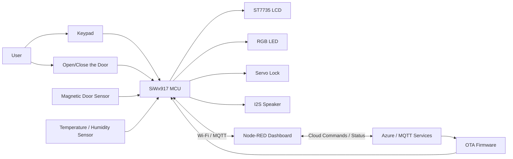

#### Challenges

- **Peripheral timing interference:** One major challenge was that the LCD, speaker, and RGB LED could interfere with each other during operation. For example, frequent LCD refreshes made the system feel slower, and audio playback or LED updates could affect the timing of other tasks. I addressed this by optimizing the LCD refresh strategy: instead of redrawing the whole screen, I used partial-region updates and fast block-filling functions for larger LCD areas. I also adjusted the initialization order of the peripherals, tuned the RGB LED timing, and changed the speaker playback chunking so that audio output would block the rest of the system less.
- **Servo motion accuracy:** Another challenge was that the servo did not always rotate by the same amount in different workflows. Deposit unlock, pickup unlock, deposit lock, and pickup lock could require slightly different timing because of mechanical friction, task scheduling, and physical differences in the lock motion. I handled this by separating the servo timing values for different actions, such as deposit unlock, pickup unlock, deposit lock, and pickup lock. This made the lock behavior more controllable, although a future improvement would be to add feedback sensing instead of relying only on timed servo movement.

#### Prototype Learnings

Building the prototype taught us that embedded systems are not just about making each component work individually. Many parts of the system worked well in isolation, such as the LCD, keypad, servo, speaker, door sensor, and MQTT connection, but the hardest problems appeared when all of them had to run together. Timing, power stability, task scheduling, and user interaction all affected each other in ways that were difficult to predict at the beginning. We also learned the importance of designing firmware around clear system states. Once the project included deposit, pickup, occupied, unlocked, door-open, alarm, and OTA modes, a state-machine structure became necessary to keep behavior predictable. This made it easier to decide what the screen should show, when the servo should move, when the RGB LED should change, and when the cloud should be updated.

If we built the device again, we would also create clearer test modes for each subsystem before full integration. For example, we would have separate diagnostic modes for the lock, LCD, keypad, speaker, sensors, MQTT, and OTA update flow. This would make debugging faster and reduce the chance of integration issues appearing late in the project. Another was that hardware power behavior matters as much as software logic. High-current components such as the servo and speaker can create voltage drops or noise that affect the rest of the system. We would design the power system earlier, separate actuator power from logic power more carefully, add more protection and filtering.

#### Next Steps & Takeaways

- **Improve lock reliability with feedback control:** To finish and improve this project, the first step is to replace the servo. The project currently uses separate servo timing values for deposit unlock, pickup unlock, deposit lock, and pickup lock. This helped compensate for mechanical differences, but the servo is still sensitive to timing, CPU scheduling, and physical friction. A future improvement would be to add feedback control instead of relying only on timed servo rotation.
- **Upgrade the LCD with LVGL and DMA:** Another future improvement is to redesign the LCD system using DMA plus LVGL. The current LCD works with GLIB and partial refresh, but it still has limitations when drawing more complex UI elements. A better version would use LVGL for structured UI components and DMA-based SPI transfer for faster, smoother screen updates. This would make it easier to build a polished interface with separate widgets for temperature, humidity, door status, locker status, pickup mode, and alarm messages, while reducing CPU blocking during display refresh.
- **Reduce power consumption through event-driven design:** The system could also be optimized for lower power consumption. Right now, many components are active frequently, including Wi-Fi, MQTT processing, sensors, LCD, RGB LED, keypad scanning, and audio output. A future version could use event-driven behavior more aggressively: reduce sensor polling rate, dim or sleep the LCD when idle, turn off LEDs when not needed, reduce speaker activity, and use lower-power Wi-Fi modes when the locker is idle. This would make the system more practical for battery-powered or energy-conscious deployments.
- **Strengthen fault handling and recovery:** Finally, set up a stronger exception handling and recovery mechanism. For example, MQTT occasionally fails to connect or loses connection, so the firmware should include a more robust reconnect strategy with backoff, status reporting, and recovery without blocking the rest of the system. Similar handling could be added for Wi-Fi failures, Azure OTA download errors, invalid pickup codes, door sensor faults, and servo timeout problems. Instead of simply failing silently or staying in an uncertain state, the system should report the reason, retry when appropriate, and keep the locker in a safe mode.

Through ESE5160, I learned how embedded systems become much more complex when hardware, software, networking, and user interaction all have to work together. In earlier assignments, I practiced individual skills like PCB design, sensors, communication, RTOS tasks, and peripheral drivers. In this course-long project, I had to combine all of those pieces into one working prototype.

I also learned the importance of state machines. The locker has many possible states: idle, occupied, door open, unlocked, alarm, remote control, and OTA update. Without a clear state machine, repeated button presses or unexpected user behavior can easily cause bugs, such as unlocking twice or allowing deposit during an alarm. Designing around states made the system safer and easier to reason about.

Overall, this project taught me how to build a realistic IoT embedded system: sensing the physical world, controlling actuators, communicating with the cloud, designing a user interface, and handling failure cases. The biggest lesson is that a working prototype is not only about making each component work individually, but about making the whole system behave predictably when real users interact with it.

#### Project Links

* Provide a URL to your Node-RED instance for our review

[http://20.57.78.220:1880/#flow/6716c356d3aa3b8d](http://20.57.78.220:1880/#flow/6716c356d3aa3b8d)

* Provide the share link to your final PCBA on Altium 365.

[https://upenn-eselabs.365.altium.com/designs/FFD7453E-AD45-40D7-A61E-3746950123C8](https://upenn-eselabs.365.altium.com/designs/FFD7453E-AD45-40D7-A61E-3746950123C8)

## 3. Hardware & Software Requirements

#### Hardware Requirements Validation

| ID     | Revised requirement                                                                                                                       | Validation test                                                                                                                          | Data / observation                                                                                                                                                                                                           | Status        |
| ------ | ----------------------------------------------------------------------------------------------------------------------------------------- | ---------------------------------------------------------------------------------------------------------------------------------------- | ---------------------------------------------------------------------------------------------------------------------------------------------------------------------------------------------------------------------------- | ------------- |
| HRS-01 | The system shall detect whether the locker door is open or closed using a magnetic door sensor connected to a GPIO input.                 | Opened and closed the locker door repeatedly while watching the LCD door indicator and the Node-RED dashboard state.                     | 20 open/close trials were tested. The LCD and dashboard changed between `OPEN` and `CLOSED` for all 20 trials after debounce.                                                                                            | Met           |
| HRS-02 | The system shall use a servo motor to unlock and lock the physical latch when commanded by the firmware.                                  | Sent `deposit`, `pickup_code:<code>`, `unlock`, and `lock` commands from Node-RED and observed the latch movement.               | 10 unlock commands and 10 lock commands were tested during bench validation. The servo moved in the expected direction each time. Lock pulse values were tuned separately for deposit and pickup flows in firmware.          | Met           |
| HRS-03 | The system shall measure temperature and relative humidity using an SHT4x sensor over I2C and report the readings to the cloud dashboard. | Ran the integrated firmware and observed periodic MQTT JSON messages on `team25/sht4x` and the dashboard temperature/humidity widgets. | The dashboard updated with nonzero temperature and humidity readings during integration testing. We did not compare the SHT4x against a calibrated thermometer or hygrometer, so sensor accuracy was not formally validated. | Partially met |
| HRS-04 | The prototype shall support the intended single-cell battery-powered product architecture.                                                | Reviewed the prototype power setup during integration.                                                                                   | The final demo prototype was primarily validated with USB/bench power. The battery-powered architecture was part of the design intent, but full standalone battery-runtime testing was not completed.                        | Not fully met |
| HRS-05 | The system shall provide stable 5 V and 3.3 V rails for the MCU and peripherals during normal operation.                                  | Powered the integrated prototype with all peripherals connected and tested the deposit, pickup, display, speaker, and sensor flows.      | The system operated through the main demo flows, but rail ripple and voltage drop under servo/speaker load were not measured with an oscilloscope or multimeter log.                                                         | Partially met |
| HRS-06 | The system shall include a numeric keypad connected through GPIO for local pickup-code entry.                                             | Entered valid and invalid 4-digit pickup codes on the keypad while the locker was occupied.                                              | Valid codes unlocked the locker, invalid codes produced an error sound, and `*` worked as backspace. 10 local keypad entries were tested successfully.                                                                     | Met           |
| HRS-07 | The system shall provide local visual, display, and audio feedback using RGB LED, ST7735 LCD, and speaker.                                | Exercised empty, occupied, unlocked, door-open, wrong-code, and alarm states.                                                            | The LCD showed locker state, door state, occupancy, and PIN entry. The RGB LED turned white for door-open and alarm color for abnormal-open state. The speaker played digit prompts and error/door prompts.                  | Met           |
| HRS-08 | The system shall use the SiWx917 MCU as the primary controller and Wi-Fi device for cloud communication.                                  | Built and ran the integrated SiWx917 firmware with Wi-Fi and MQTT enabled.                                                               | The board connected to Wi-Fi, exchanged MQTT messages with the Node-RED broker, and handled OTA commands through the SiWx917 networking stack.                                                                               | Met           |

#### Software Requirements Validation

| ID     | Revised requirement                                                                                                                                    | Validation test                                                                                     | Data / observation                                                                                                                                                                                                                         | Status        |
| ------ | ------------------------------------------------------------------------------------------------------------------------------------------------------ | --------------------------------------------------------------------------------------------------- | ------------------------------------------------------------------------------------------------------------------------------------------------------------------------------------------------------------------------------------------ | ------------- |
| SRS-01 | When the door state changes, the firmware shall update its internal door state and publish the latest door value in the `team25/sht4x` JSON payload. | Opened and closed the door while monitoring the dashboard and MQTT payload.                         | The `door_open` Boolean changed between `true` and `false` in the published JSON. Door-state changes also triggered immediate status publication instead of waiting for the normal interval.                                         | Met           |
| SRS-02 | When the locker is empty and closed, the firmware shall accept a cloud `deposit` command and unlock the servo for package deposit.                   | Clicked the Store/Deposit flow in Node-RED while the locker was empty.                              | Node-RED sent `deposit` to `team25/input`; the firmware moved to `UNLOCKED`, actuated the servo, and allowed the door to open.                                                                                                       | Met           |
| SRS-03 | After a deposit is closed, the firmware shall mark the locker as occupied and publish the occupied state.                                              | Ran a full deposit flow: send deposit, open door, place item, close door.                           | After the close debounce period, the firmware locked the servo and published `occupied:true` on `team25/sht4x`; the dashboard changed to Occupied.                                                                                     | Met           |
| SRS-04 | The cloud dashboard shall generate a temporary 4-digit pickup code and synchronize that code to the MCU.                                               | Used the Pickup flow in Node-RED and clicked Get Code.                                              | Node-RED generated a 4-digit code, displayed it in the UI, and sent `pickup_start:<code>` or `code_sync:<code>` to the MCU. The firmware stored the 4-digit code for later validation.                                                 | Met           |
| SRS-05 | When a valid pickup code is entered through the keypad or cloud dashboard, the firmware shall unlock the servo.                                        | Tested pickup using both Node-RED `pickup_code:<code>` and the physical keypad followed by `#`. | Valid codes caused the firmware to set access reason to pickup, unlock the servo, and enter `UNLOCKED`. Invalid codes were rejected and played an error sound.                                                                           | Met           |
| SRS-06 | After an authorized pickup is opened and then closed, the firmware shall mark the locker empty again and publish the updated state.                    | Ran full pickup flow: get code, unlock, open door, remove item, close door.                         | After the door-close confirmation delay, the firmware locked the servo, cleared occupied state, and published `occupied:false`; the dashboard returned to Empty.                                                                         | Met           |
| SRS-07 | The firmware shall periodically publish temperature, humidity, door, occupancy, alarm, alarm reason, and firmware version as JSON.                     | Monitored MQTT traffic from the integrated firmware.                                                | Published JSON included `temperature_c`, `humidity_rh`, `door_open`, `occupied`, `alarm`, `alarm_reason`, and `version`. The normal publish interval is 1 second, with faster retry behavior when publish is busy/not ready. | Met           |
| SRS-08 | If the door is opened when opening is not allowed, the firmware shall enter alarm mode and publish an alarm status.                                    | Opened the door while the locker was not in an authorized unlocked/door-open flow.                  | The firmware entered `ALARM`, showed `ALARM` on the LCD, changed LED output, and published `alarm:true` with reason `Abnormal door opening detected`.                                                                              | Met           |
| SRS-09 | The cloud dashboard shall be able to clear an alarm state.                                                                                             | Sent `alarm_clear` from Node-RED after creating an alarm condition.                               | The firmware cleared `current_alarm_reason` and restored the mode based on door and occupancy state.                                                                                                                                     | Met           |
| SRS-10 | The firmware shall support OTA update command handling through the cloud dashboard when the locker is empty and closed.                                | Sent `ota_update` from Node-RED with the locker empty and closed.                                 | The firmware published OTA status on `team25/ota`, downloaded from Azure using HTTPS OTA, and prepared for reboot on success. OTA is intentionally rejected when the locker is occupied or the door is open.                             | Met           |
| SRS-11 | The local LCD shall display the main user states: empty, occupied/PIN entry, unlocked, door open, alarm, and OTA.                                      | Exercised each state during integration testing.                                                    | The ST7735 showed `Locker Empty`, `Enter PIN`, `Unlocked`, `Door Open`, `ALARM`, and OTA status screens.                                                                                                                         | Met           |
| SRS-12 | The system shall reconnect MQTT automatically after disconnect/error.                                                                                  | Reviewed and tested the MQTT service behavior during network interruptions.                         | `mqtt_service_process()` attempts reconnects every 3 seconds after disconnection. This was implemented in firmware, but extended long-duration network fault testing was not completed.                                                  | Partially met |

#### Requirement Review Summary

Most of the core locker behavior was met: door sensing, servo locking, keypad pickup, cloud deposit/pickup control, MQTT status publishing, alarm handling, LCD/RGB/speaker feedback, and OTA command handling all worked in the integrated prototype. The main gaps were in quantitative hardware validation. We did not complete calibrated temperature/humidity accuracy testing, battery runtime testing, or measured 5 V/3.3 V rail stability under worst-case servo and speaker load. These are the areas we would test more rigorously in the next hardware revision.

## 4. Project Photos & Screenshots

#### Overall view

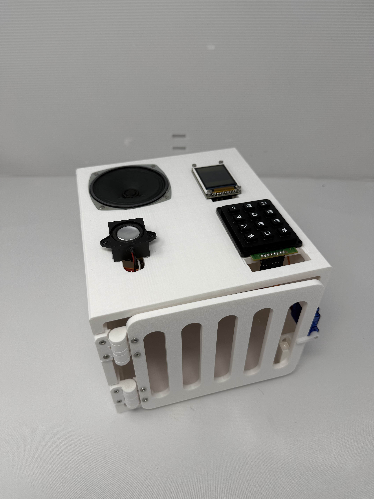

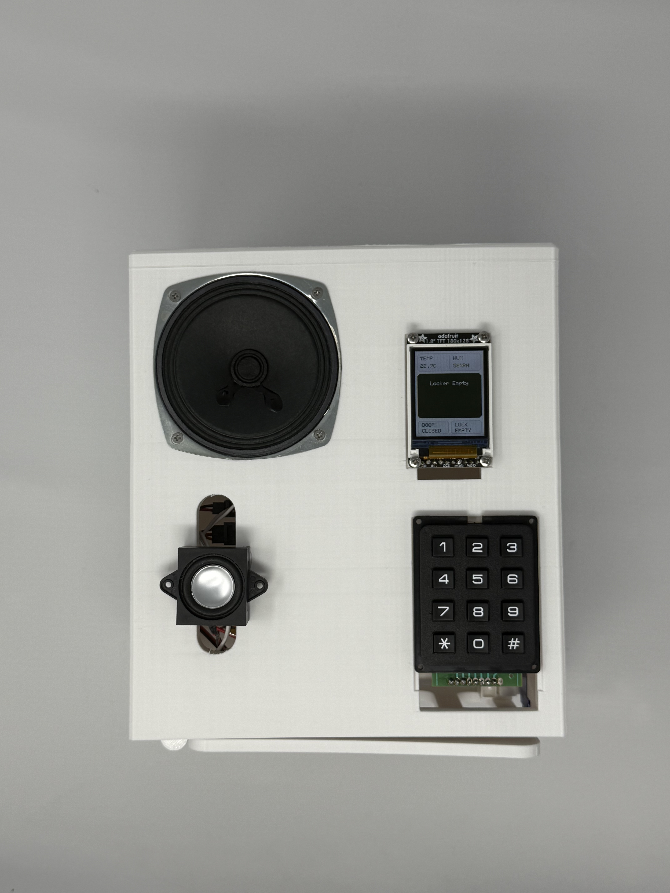

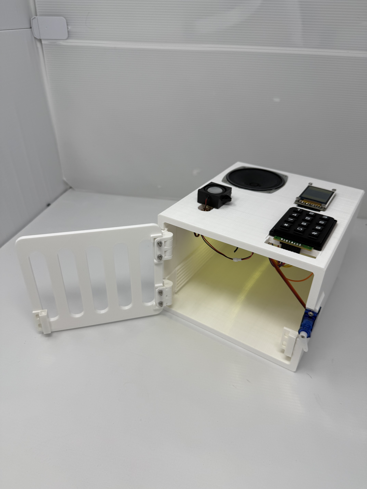

#### The standalone PCBA, top

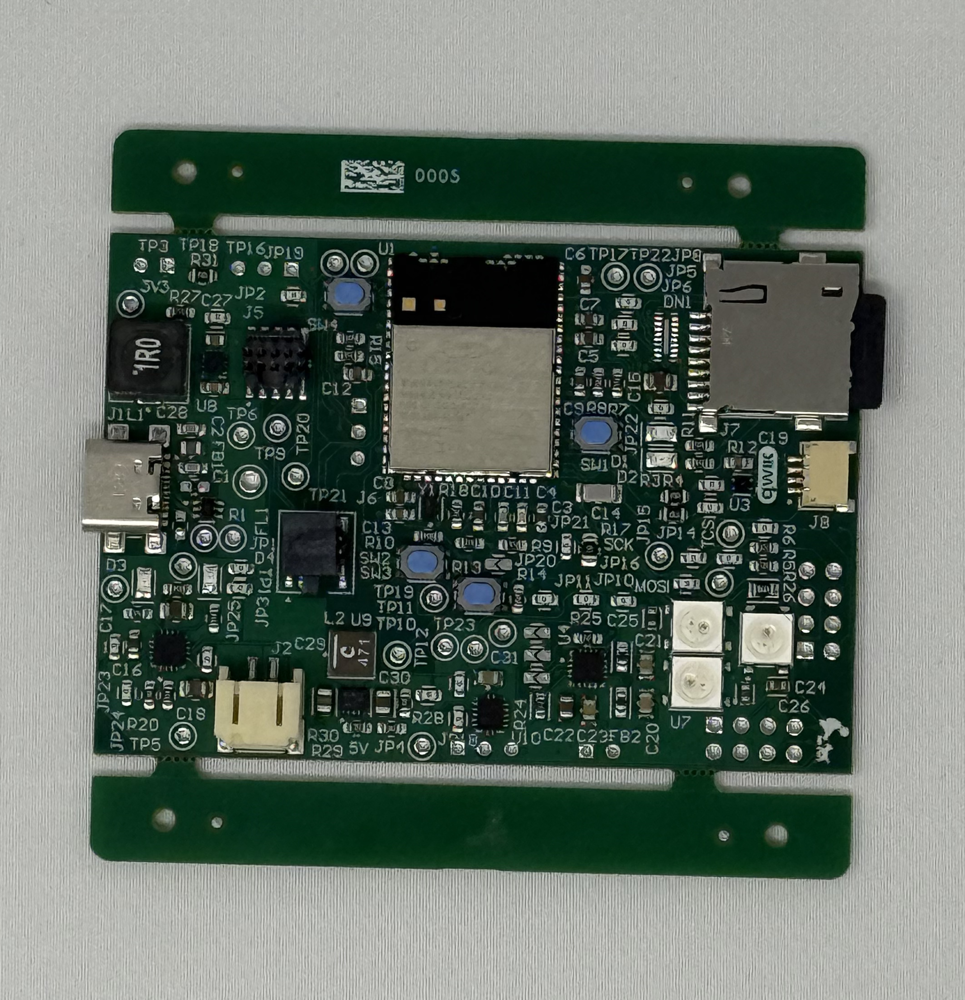

#### The standalone PCBA, bottom

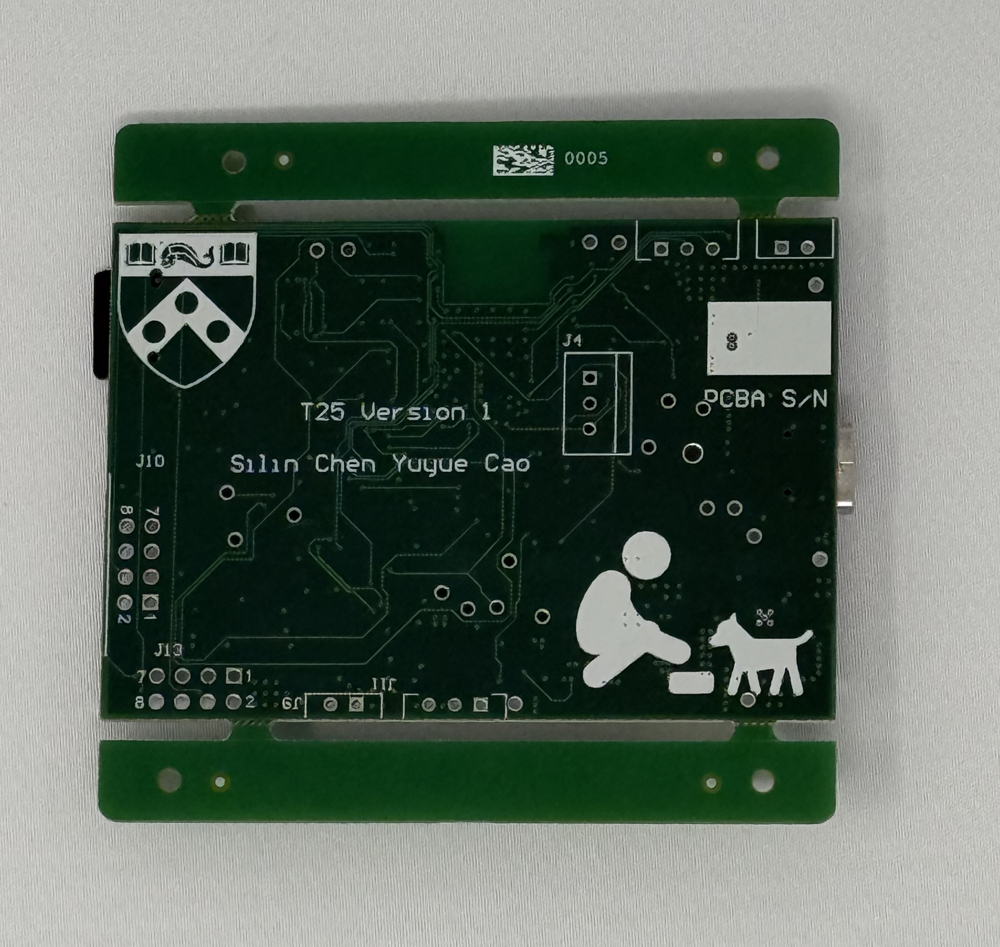

#### Thermal camera images

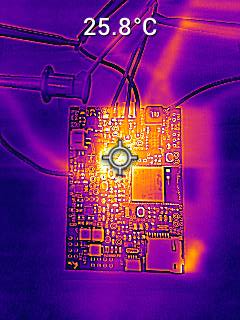

#### The Altium Board design in 2D view

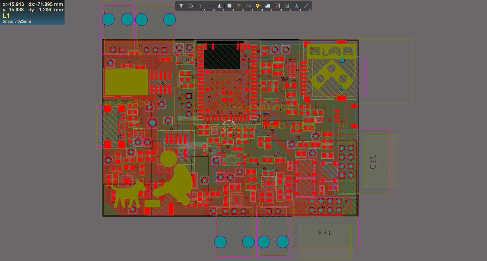

#### The Altium Board design in 3D view

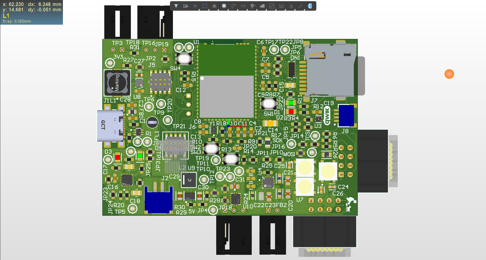

#### Node-RED dashboard

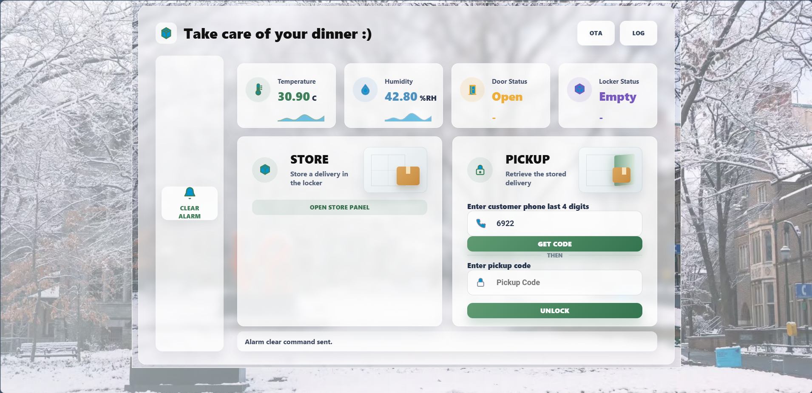

#### Node-RED backend

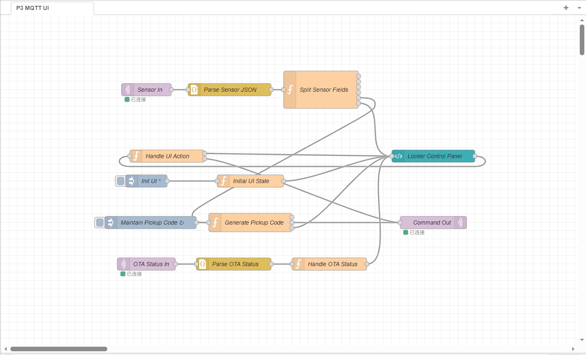

#### Block diagram of system

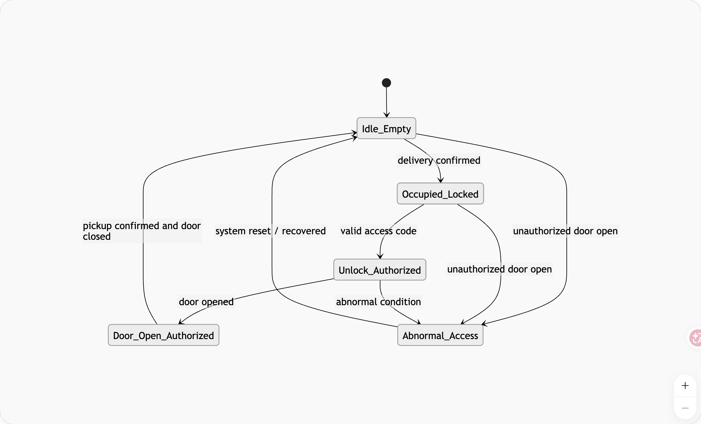

#### 3D model

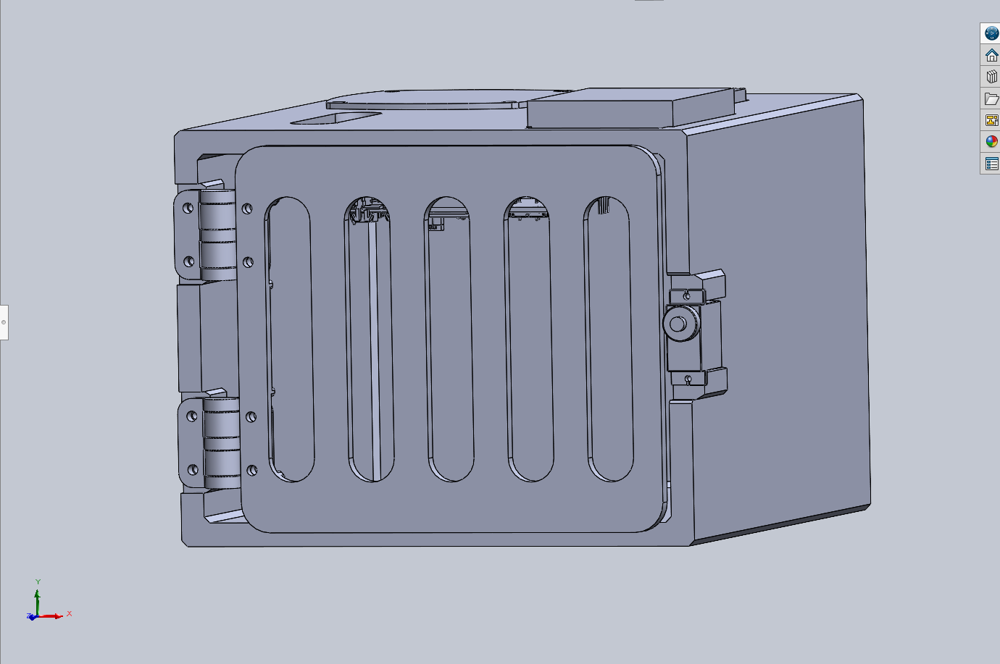

## 5. Codebase

- Final embedded C firmware codebase: [Firmware Repository](https://github.com/ese5160/final-project-firmware-s26-t25-feeding-the-watchdog/tree/main/integrate)
- Node-RED dashboard code: [Node-RED Dashboard Flow](https://github.com/ese5160/final-project-firmware-s26-t25-feeding-the-watchdog/blob/main/Node-RED/flows_integrate.json)
